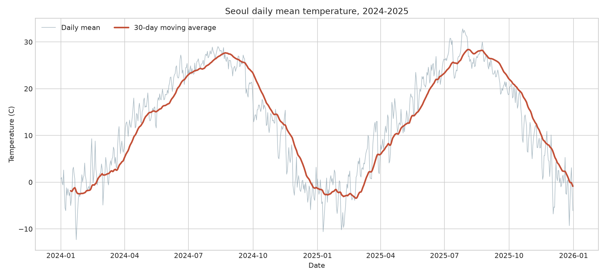
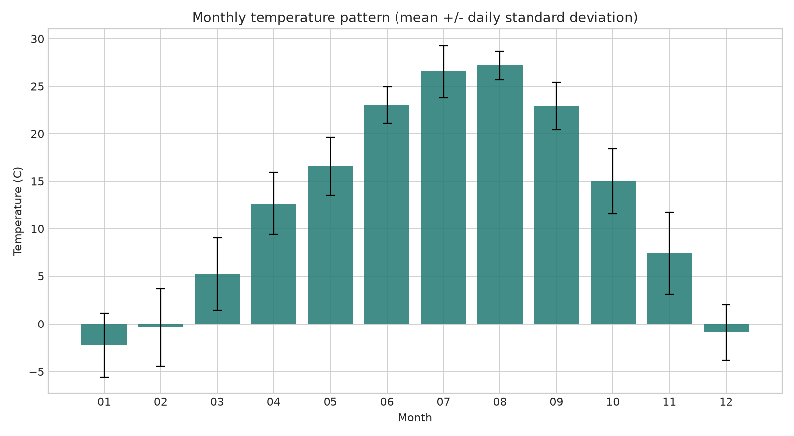
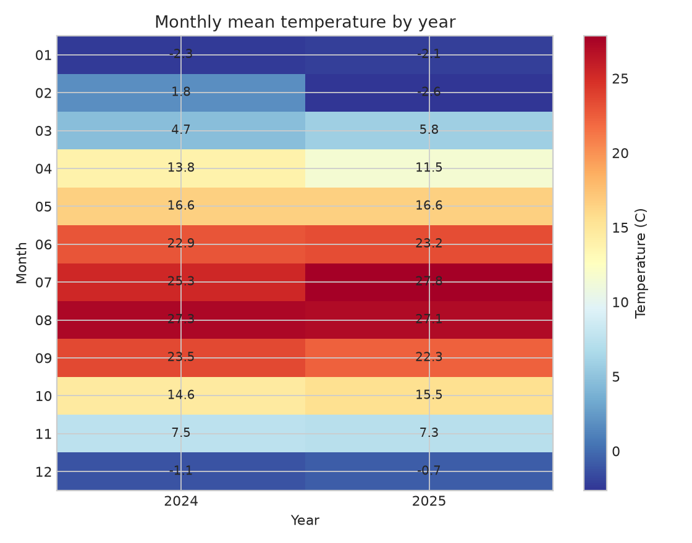
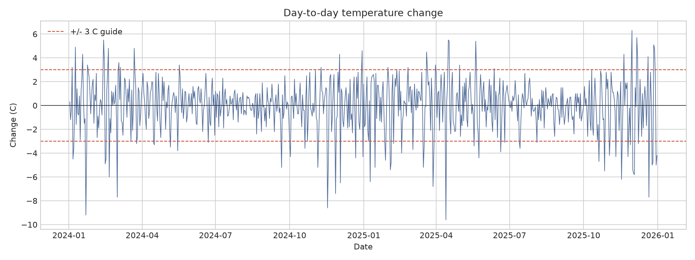

# 서울 일별 평균기온 트렌드 분석 리포트

## 1. 분석 주제 및 선정 이유

서울의 2024~2025년 일별 평균기온을 분석한다. 날씨는 시간에 따른 계절성이 분명해 트렌드와 계절성의 차이를 살펴보기 좋고, 짧은 기간의 급격한 일별 변동도 이동평균과 변화량으로 확인할 수 있다. 이 분석은 과거 날씨를 설명하기 위한 것이며 기후변화의 장기 추세를 추론하려는 목적은 아니다.

## 2. 분석 질문

1. 2024~2025년 일별 평균기온에 뚜렷한 계절 패턴이 나타나는가?
2. 월별 평균기온 차이는 어느 정도이며, 두 해의 월별 패턴은 비슷한가?
3. 30일 이동평균으로 일별 잡음을 줄이면 계절의 전환 시점이 어떻게 보이는가?
4. 일별 변화가 가장 컸던 시점은 언제이며, 그 값은 평소의 변동과 어떻게 다른가?

## 3. 데이터 설명 및 정제

- 출처: [Open-Meteo Historical Weather API](https://open-meteo.com/en/docs/historical-weather-api), `temperature_2m_mean`
- 위치/기간: 서울(위도 37.5665, 경도 126.9780), 2024-01-01~2025-12-31, Asia/Seoul
- 단위/빈도: 섭씨(°C), 일별 평균, 달력 날짜별 1개 데이터
- 관측 수: 실행 결과에 표시되는 날짜 수(요청 기간 전체면 731개)
- 변수: 날짜, 일별 평균기온(°C)
- 결측/중복/이상치: 스크립트가 결측·중복·범위 이탈 개수를 출력한다. 날짜 중복은 마지막 값만 남기고, 내부 결측은 최대 2일까지만 시간 기준 선형 보간한다. 그보다 긴 결측은 임의로 채우지 않고 분석을 중단한다. 서울 평균기온의 넓은 점검 범위인 -35~45°C 밖의 값은 삭제하거나 보정하지 않고 오류로 중단해 원자료 확인을 요구한다. 이 범위는 이상치를 통계적으로 증명하는 기준이 아니라 명백한 입력 오류를 찾기 위한 물리적 타당성 점검이다.

기온의 IQR 통계상 극단값은 계절별 정상적인 한파·폭염일 수 있으므로 자동 제거하지 않는다. 해당 값의 날짜와 주변 추이를 그래프에서 확인한다.

## 4. 분석 방법 및 시각화

일별 평균기온, 30일 이동평균, 30일 표준편차, 전일 대비 기온 변화량, 월별 평균과 표준편차, 연도별 월평균을 계산했다. 일별 자료는 짧은 날씨 변동을 보존하고, 30일 이동평균은 일별 잡음을 완화해 계절 흐름을 읽기 위해 사용했다. 월별 집계는 반복되는 계절 패턴 비교에 적합하다.

### 4.1 일별 기온과 이동평균

일별 선은 단기 변동을, 30일 이동평균은 완만한 계절 흐름을 보여준다. 이 그림은 연중 반복 패턴을 확인하는 데 쓰며, 2년 자료의 기울기를 장기 기후 추세로 해석하지 않는다.

### 4.2 월별 평균과 일별 표준편차

막대 높이는 각 월의 평균기온이고 오차 막대는 해당 월에 속한 일별 기온의 표준편차다. 표준편차에는 계절 내 날씨 변화와 두 연도 차이가 함께 반영된다.

### 4.3 연도별 월평균 비교

같은 달의 월평균을 연도별로 비교해, 두 해의 계절 모양이 비슷한지와 개별 월의 차이를 살펴본다.

### 4.4 전일 대비 변화량

전일 대비 차이는 급격한 기온 변화를 찾는 지표다. 점선 ±3°C는 사건 판정 기준이 아니라 그래프에서 큰 변동을 빠르게 찾기 위한 참고선이다.

## 5. 인사이트

1. **계절성이 뚜렷하다.** 관찰: 가장 따뜻한 달은 8월(평균 27.18°C), 가장 추운 달은 1월(-2.22°C)이며 월평균 간격은 29.40°C다. 해석: 반복되는 여름·겨울 대비는 이 자료에서 계절성이 큰 변동 요인임을 보여준다. 다만 두 해만으로 매년 같은 크기라고 일반화할 수 없다. 행동: 계절 효과를 분리하지 않은 단순 전년 대비 비교는 피하고, 더 긴 기간 자료와 함께 비교한다.
2. **연평균은 비슷해도 월별 차이는 가려질 수 있다.** 관찰: 연평균은 2024년 12.88°C, 2025년 12.73°C로 0.15°C 차이지만, 가장 큰 월별 차이는 2월로 2025년이 2024년보다 4.45°C 낮았다(2024년 1.81°C, 2025년 -2.65°C). 해석: 연평균만 보면 월별로 상쇄된 차이를 놓칠 수 있고, 이 두 해의 차이를 장기적인 온난화나 한파 원인으로 볼 근거는 없다. 행동: 후속 분석에서는 계절별·월별 연도 차이와 평년값 대비 편차를 함께 계산한다.
3. **하루 사이 큰 하강이 관찰됐다.** 관찰: 절대 변화가 가장 큰 날은 2025-04-13으로 전일 대비 -9.60°C였다. 해석: 전선 통과, 강수, 기단 변화 등이 가능한 설명이지만 이 데이터만으로 원인을 판정할 수 없다. 행동: 해당 날짜의 관측소 기온·강수·바람 자료 및 기상 특보와 교차 확인한다.
4. **이동평균은 잡음을 줄이지만 급변을 늦게 보여준다.** 관찰: 30일 평균선은 일별 선보다 매끄럽고, 계절 전환은 일별 피크보다 완만하게 나타난다. 해석: 이동평균에는 과거 30일이 포함되어 급격한 변화가 지연·완화되어 보인다. 행동: 계절 추세 설명에는 이동평균을, 급격한 변화 탐지에는 일별 변화량을 병행한다.

## 6. 결론 및 한계점

서울의 2년 일별 평균기온에서 월별 계절 패턴과 단기 변동을 확인하고, 이동평균과 변화량이 서로 다른 질문에 답하는 것을 살펴본다. 분석 코드는 결측·중복·물리적 타당성 점검을 명시하며 원자료를 재사용하거나 다시 수집할 수 있다.

- 기간이 2년에 불과해 장기 기후변화나 장기 추세를 판단할 수 없다.
- API의 재분석 기반 모델값은 실제 관측소 측정값과 차이가 있을 수 있고, 좌표 한 지점은 서울 전체의 미기후를 대표하지 않는다.
- 월별 표준편차와 연도 차이는 표본이 두 해뿐이어서 안정적인 기후 통계로 볼 수 없다.
- 외부 기상 요인과 사건 자료를 결합하지 않았으므로 급변의 원인을 확정하지 않는다.
- 30일 이동평균은 경계 구간에서 관측치가 적으며 급격한 변화를 평활화한다.
- 날짜별 값/모델 자료의 갱신으로 재수집 시 수치가 달라질 수 있다.

## 7. AI 사용 로그

- 사용 작업: 분석 질문 구성, Python 수집·정제·시각화 코드 초안, 리포트 구조와 문장 작성
- 사용 이유: 분석 절차를 빠르게 구조화하고 이동평균·월별 집계 등 대안 기법을 정리하기 위해
- 검증 방법: API 응답 구조와 요청 기간을 코드에서 확인하고, 실행 시 날짜 수·결측·중복·범위 이탈을 점검한다. 통계 요약을 원자료에서 다시 계산하고 그래프에 사용한 집계와 대조한다. AI가 제안한 원인 설명은 외부 자료와 대조되지 않는 한 가설로만 기술한다.

## 8. 재현 방법 및 라이선스

프로젝트 루트에서 `python -m pip install -r requirements.txt` 후 `python analysis.py`를 실행한다. 포함 CSV 기준으로 그래프를 재생성하며, 재수집은 `python analysis.py --refresh`로 한다. 데이터 출처 및 이용 조건은 [Open-Meteo Historical Weather API](https://open-meteo.com/en/docs/historical-weather-api)에서 확인하고, 재배포 시 Open-Meteo 출처를 표시한다.